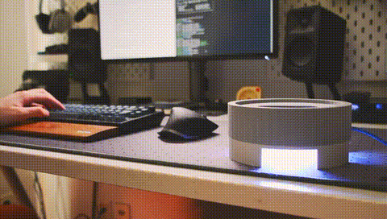

#SipSync – dein smarter Trink-Companion

SipSync ist ein Untersetzer, der uns dabei unterstützen soll, über den Tag hinweg regelmäßiger zu trinken. Statt mit einem klassischen Timer oder einer nüchternen Erinnerung zu arbeiten, reagiert SipSync mit Licht und Klang und soll dadurch eher wie ein kleiner Begleiter auf dem Schreibtisch wirken als wie ein technisches Gerät.

Entstanden ist SipSync im Modul *Interaktive Systeme* im Sommersemester 2026 an der Technischen Hochschule Brandenburg.

## Inhalt

- [Team](#team)
- [Konzept](#konzept)
- [Hardware](#hardware)
- [Dateistruktur](#dateistruktur)
- [Zustandsautomat](#zustandsautomat)
- [Verwendung](#verwendung)

## Team

- Felix Jeske
- Rafael Koschlik
- Henri Burza
- Khalil Al Ani

## Konzept

  

Die Grundidee: Ein Ultraschallsensor erkennt, ob ein Getränk auf dem Untersetzer steht. Solange regelmäßig getrunken wird, bleibt SipSync ruhig. Vergeht zu viel Zeit ohne dass das Glas angehoben wird, eskaliert die Rückmeldung schrittweise – von einem dezenten Farbwechsel bis zu einer deutlich präsenteren Anzeige, begleitet von Vogelzwitschern über den Buzzer. Wird das Getränk angehoben und wieder abgestellt, reagiert SipSync unabhängig vom vorherigen Zustand mit einer kurzen, positiven Rückmeldung.

## Hardware

- Arduino Uno
- 8×8 RGB-LED-Matrix (Adafruit NeoPixel)
- Piezo-Buzzer
- HC-SR04-Ultraschallsensor, per Lötbrücke auf I²C-Betrieb umgestellt (RCWL-9200-Chip)
- Gehäuse aus PLA, im 3D-Druck gefertigt

Das Verdrahtungsschema ist im Projektbericht (Abbildung 1) dokumentiert.

## Dateistruktur

- [`SipSyncFinal.ino`](./SipSyncFinal.ino) – Hauptdatei, Zustandslogik
- [`ledMatrix.h`](./ledMatrix.h) – LED-Animationen (Pulse, Rainbow, Breathing)
- [`birdChirp.h`](./birdChirp.h) – Tonsequenzen für den Buzzer
- [`proximity.h`](./proximity.h) – Ultraschallsensor-Anbindung (I²C)

Der Code ist bewusst auf mehrere Dateien verteilt, damit Zustandslogik, Licht, Ton und Sensorabfrage getrennt bleiben und sich unabhängig voneinander anpassen lassen.

## Zustandsautomat

SipSync durchläuft sieben Zustände:

| Zustand | Bedeutung |
|---|---|
| IDLE | kein Glas erkannt, weißes Pulsieren |
| CONFIRM | Glas wurde abgestellt, kurze grüne Bestätigung |
| WAITING | alles gut, keine Warnung |
| YELLOW | erste Erinnerungsstufe |
| ORANGE | zweite Erinnerungsstufe |
| RED | dringlichste Erinnerungsstufe |
| HAPPY | Glas wurde angehoben und wieder abgestellt – positive Rückmeldung |

Alle Zeiten (Eskalationsdauern, Chirp-Rhythmus) sind zentral am Anfang von `SipSyncFinal.ino` einstellbar.

## Verwendung

1. Alle vier Dateien in einen gemeinsamen Sketch-Ordner legen (Dateiname muss mit `SipSyncFinal.ino` übereinstimmen).
2. [Adafruit NeoPixel Library](https://github.com/adafruit/Adafruit_NeoPixel) über den Arduino Library Manager installieren.
3. Verkabelung gemäß Schema im Projektbericht aufbauen.
4. Sketch auf den Arduino Uno hochladen.

## Weiterführende Dokumentation

- 📄 [Projektbericht](./SipSync_Projektbericht.pdf) – vollständige Dokumentation inkl. Konzept, Systementwurf, Evaluation und Fazit
